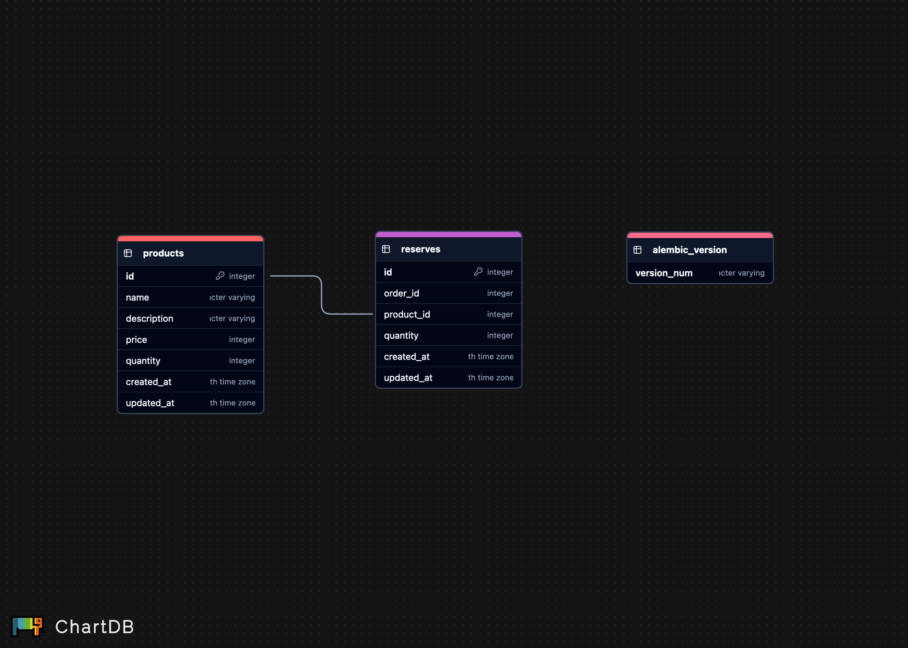
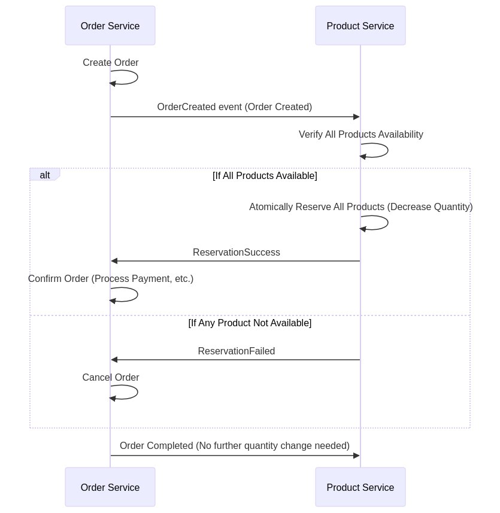

This is a learning project where I created Event Driven Products microservice using FastAPI, using FastStream for RabbitMQ.

This repo contains my implementation of a simple but effective auth service that handles:

CRUD for Products
EventHandler from Order Service for reserving products

